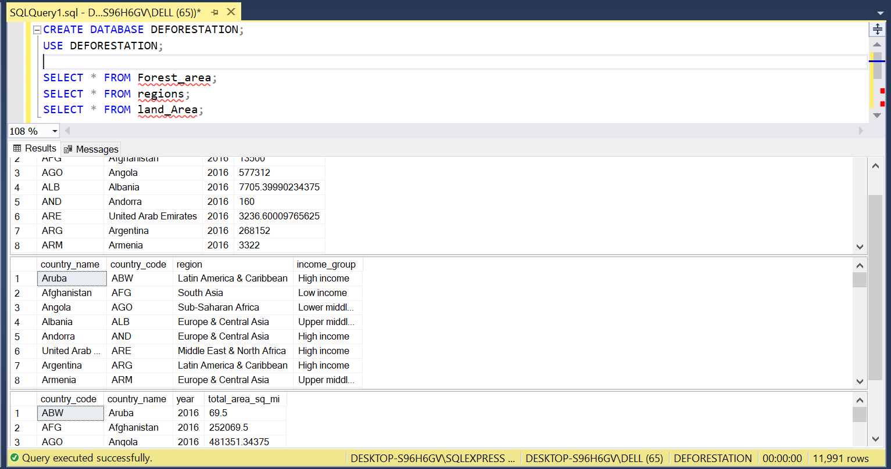
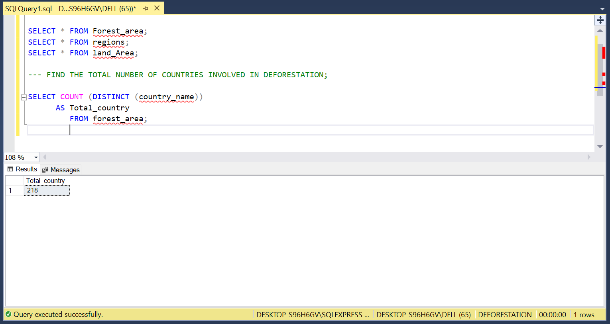
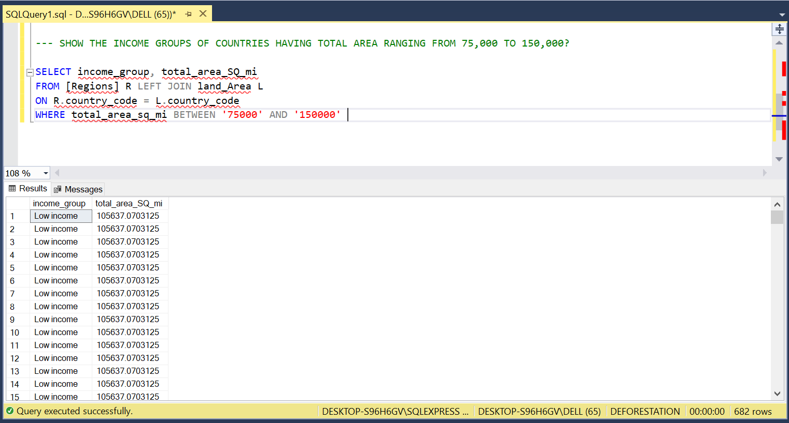
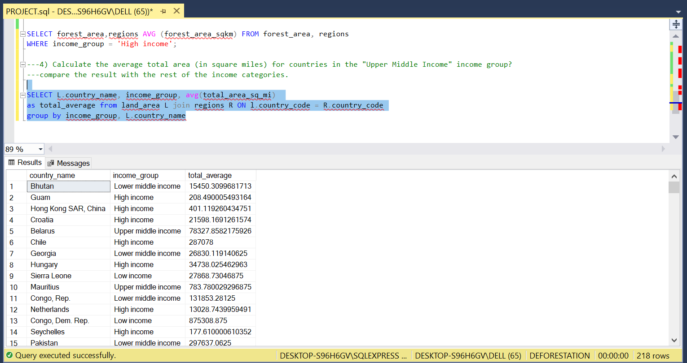
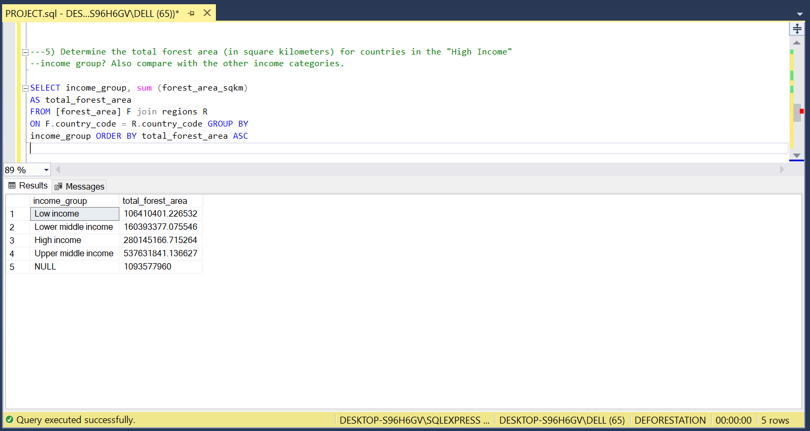
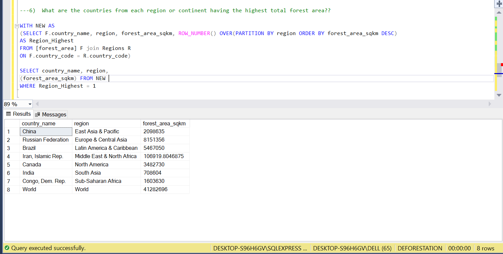

# DEFORESTATION_SQL_PROJECT

The herein repository host the SQL scripts and a data picture report (Deforestation report)
for the herein analysis. This is part of the SQL final project training.

## INTRODUCTION.

The project is to process Deforestation Data provided and extract knowledge from these datasets by quering them 
onto an SQL database and take screenshots of functions and statements used in query language for each question, 
such that it can help solve various use case scenarios regarding conservation of forests.
**_DISCLAIMER_** all datasets and reports do not represent any company, institution or country. just an ordinary 
datasets to be used for personal projects.

### AIM OF THE PROJECT.

- To explore and analyse the dataset by writing simple SQL queries.
- Understand and provide screenshots with regards to the Deforestation trend between 1990 - 2016.

### OBJECTIVE OF THE PROJECT.
- Perform SQL queries using SQL joins, window functions, sub-queries and data cleaning functions.

### CASE STUDY.
 
From this project three datasets were provided and they consist of files in comma seperated values(CSV) 
and were imported into the database.
- Forest_area
- land_Area
- Regions

## PROBLEM STATEMENT.

- Find the total number of countries involved in deforestation?
- Show the income groups of countries having total area ranging from 75,000 to 150,000?
- Calculate the average total area (in square miles) for countries in the "Upper Middle Income"
  income group? compare the result with the rest of the income categories?
  Hint: calculate average total areas for the 3 other categories
- Determine the total forest area (in square kilometers) for countries in the "High Income" 
  income group? Also compare with the other income categories.
- What are the countries from each region or continent having the highest total forest area??

## ANALYSIS AND QUERIES.

CREATE DATABASE DEFORESTATION;
USE DEFORESTATION;

SELECT * FROM Forest_area;
SELECT * FROM regions;
SELECT * FROM land_Area;

- FIND THE TOTAL NUMBER OF COUNTRIES INVOLVED IN DEFORESTATION;

  SELECT COUNT (DISTINCT (country_name))
    AS Total_country
      FROM forest_area;

- SHOW THE INCOME GROUPS OF COUNTRIES HAVING TOTAL AREA RANGING FROM 75,000 TO 150,000?

   SELECT income_group, total_area_SQ_mi
      FROM [Regions] R LEFT JOIN land_Area L
         ON R.country_code = L.country_code
             WHERE total_area_sq_mi BETWEEN '74999' AND '149999'

- Calculate the average total area (in square miles) for countries in the "Upper Middle Income"
  income group?compare the result with the rest of the income categories.

  SELECT L.country_name, income_group, avg(total_area_sq_mi) 
     AS total_average from land_area L JOIN regions R ON l.country_code = R.country_code
          GROUP BY income_group, L.country_name
  
- Determine the total forest area (in square kilometers) for countries in the "High Income" 
  income group? Also compare with the other income categories. 

  SELECT income_group, SUM (forest_area_sqkm)
     AS total_forest_area
        FROM [forest_area] F JOIN regions R
          ON F.country_code = R.country_code
             GROUP BY income_group ORDER BY total_forest_area ASC

- What are the countries from each region or continent having the highest total forest area??

  WITH NEW AS
      (SELECT F.country_name, region, forest_area_sqkm, ROW_NUMBER() OVER(PARTITION BY region 
          ORDER BY forest_area_sqkm DESC)
               AS Region_Highest
                  FROM [forest_area] F JOIN Regions R
                    ON F.country_code = R.country_code)
SELECT country_name, region, 
      (forest_area_sqkm) FROM NEW 
          WHERE Region_Highest = 1

## PICTURE ANALYSIS

- Deforestation dataset and Tables

  
  ---

- Find the total number of countries involved in deforestation?

  
  ---
  
- Show the income groups of countries having total area ranging from 75,000 to 150,000?

  
  ---

- Calculate the average total area (in square miles) for countries in the "Upper Middle Income"
  income group? compare the result with the rest of the income categories?
  Hint: calculate average total areas for the 3 other categories

  
  ---
  
- Determine the total forest area (in square kilometers) for countries in the "High Income" 
  income group? Also compare with the other income categories.

  
  ---
  
- What are the countries from each region or continent having the highest total forest area??

  
  ---

# CONCLUSION

Deforestation is a major threat to the environment, contributing to climate change, loss of biodiversity, and soil degradation.
I found out that the total number of countries involved in deforestation according to this data is 218 countries,
the income groups of countries having total area ranging from 75,000 to 150,000 were mostly low income groups.
the total forest area (in square kilometers) for countries in the "High Income" income group was 280145166.715624
the countries from each region with the highest total forest area is china and congo being the lowest. this project was a challenging one 
but i improved my skills at the end of it. Thank you for reading.

**_THE END_**

